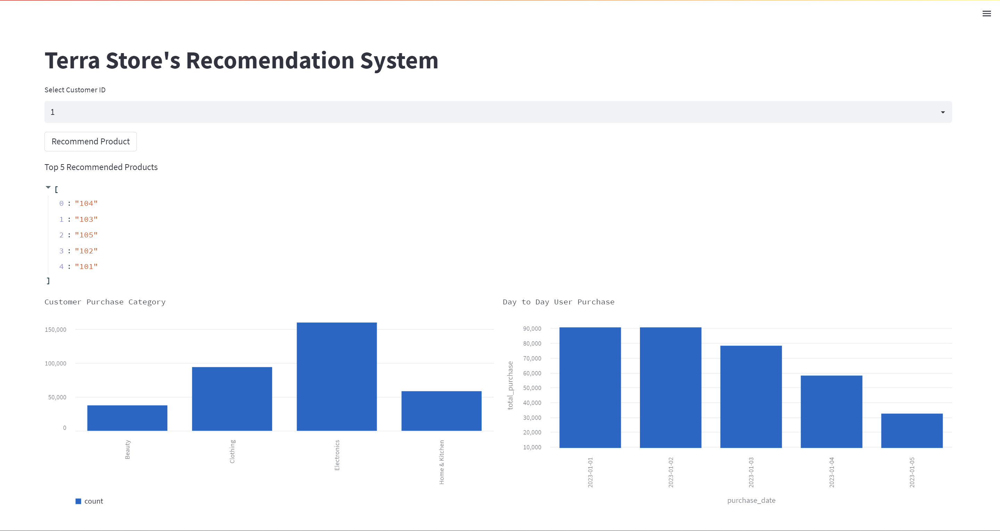

# Terra Store Recommendation System


# How To Run
```
# Build Docker Container
docker build -t terra_app .

# Running Docker Container
docker run -p 8501:8501 terra_app
```

# Project Documentation

## Dataset Strategy

   - Customer Interactions:

     1. Customer ID
     2. Page views
     3. Time spent on the website

   - Purchase History:

     1. Customer ID
     2. Product ID
     3. Purchase date

   - Product Details:

     1. Product ID
     2. Category
     3. Price
     4. Ratings

   Due lack of provided dataset, we using syntentic generator libraries called [sdv](https://github.com/sdv-dev/SDV) to generate n-sample of rows according datasets.

## Data Analytics


Customer has their own similar pattern about product purchases, this pattern might be generate because not much variety from sytentic data generator.

## Model Choosen

We choose K-Nearest Neigbours in terms of Content Based Recommendation System due lack of variety dataset and limited scope of products.

## Evaluation Metrics

We choose average precision, recall, and f1-score at 5-shot sampling recommendation data, with result all of them is 100% due dataset doesnt have enough variety.